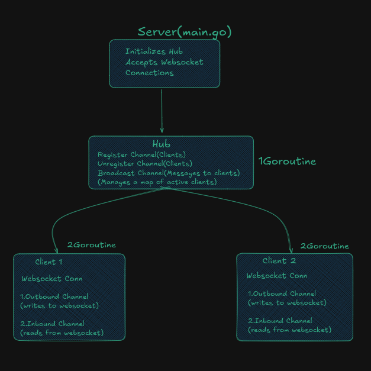
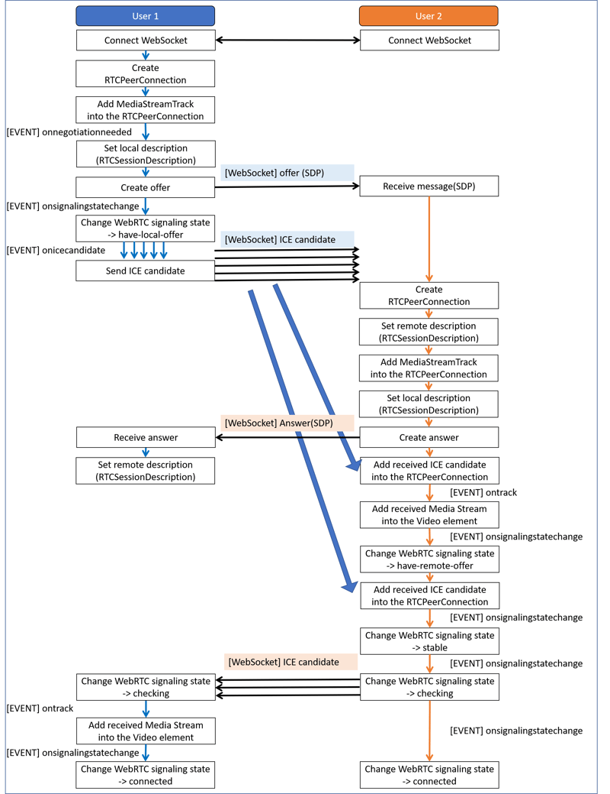

# goMeet

## 🎯 Implementation Checklist

- [X] Chat app  
    -[X] http to ws
    -[X] register/unregister/broadcast
    -[X] read and write msg
    -[X] base static html
- [X] Basic Server Setup with Fiber & Template Engine
- [X] WebRTC added(helper package)

---
### Learning source:
- [WebRTC Slides](https://www.canva.com/design/DAGUMM1C5JQ/pwez02rC2mCP5obly4StsA/edit?utm_content=DAGUMM1C5JQ&utm_campaign=designshare&utm_medium=link2&utm_source=sharebutton) 
- Slides Credits to: [Hussein Nasser](https://www.youtube.com/@hnasr) 
- WebRTC for Better understanding(how WebRTC works under the hood) -> [Live Demo For the WebRTC API](https://webrtc.github.io/samples/src/content/peerconnection/multiple/)
- [WebRTC For The Curious](https://webrtcforthecurious.com/)

Chat Flow:
  

---

**WebRTC Signaling and Connection Establishment Flow using WebSocket**
 

