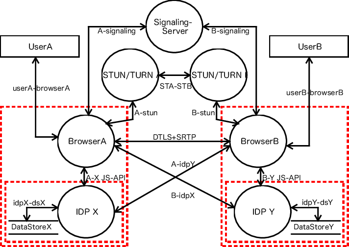

# goMeet

## 🎯 Implementation Checklist

- [X] Chat app  
    -[X] http to ws
    -[X] register/unregister/broadcast
    -[X] read and write msg
    -[X] base static html
- [X] Basic Server Setup with Fiber & Template Engine
- [ ] Room Management System
  - [X]Create/Join rooms with UUID
  - [ ]Room state handling
- [ ] WebSocket Implementation
  - Room WebSocket
  - Chat WebSocket
  - Viewer WebSocket
- [ ] Streaming Capabilities
  - Stream creation
  - Stream WebSocket
  - Stream chat integration
- [ ] Real-time Communication
  - WebRTC peer connections
  - Key frame dispatch (interval timing need to decide)
- [ ] Static Asset Serving
- [ ] SSL/TLS Support for Secure Connections
- [ ] Error Handling & Recovery System
- [ ] Connection Pooling & Resource Management
- [ ] API Documentation & Usage Guide

[WebRTC Slides](https://www.canva.com/design/DAGUMM1C5JQ/pwez02rC2mCP5obly4StsA/edit?utm_content=DAGUMM1C5JQ&utm_campaign=designshare&utm_medium=link2&utm_source=sharebutton)
 
Slides Credits to: [Hussein Nasser](https://www.youtube.com/@hnasr)

Chat Flow:
 

---
